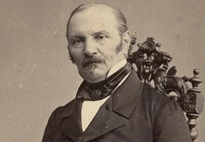
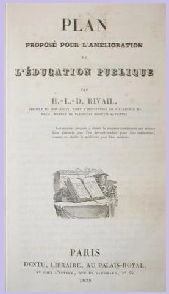

O Professor **Hippolyte Léon Denizard Rivail**, antes de assinar como Allan Kardec, foi um dos maiores expoentes da pedagogia francesa no século XIX. Sua estrutura mental, forjada no rigor científico e na educação humanista, foi o instrumento preciso escolhido pela Espiritualidade Superior para a Codificação.

## A Escola de Pestalozzi e o Método Intuitivo

A base do pensamento de Rivail foi construída no Instituto de Yverdun, na Suíça, sob a tutela direta de **Johann Heinrich Pestalozzi**. Ali, ele absorveu os princípios que revolucionariam a educação mundial:

* **Educação Integral:** O desenvolvimento harmônico das faculdades físicas, intelectuais e, sobretudo, morais.
* **O Método Intuitivo:** O aprendizado que parte do concreto para o abstrato, priorizando a observação e a experiência direta.
* **Educação de "Dentro para Fora":** A visão de que o educador deve auxiliar o desabrochar das potências internas do aluno, e não apenas depositar informações.

## Moralidade e a Abolição dos Castigos

Uma das maiores contribuições de Rivail (e um dos pontos centrais de sua identidade pedagógica) foi a luta contra os métodos disciplinares violentos da época. Numa França onde a palmatória era comum, Rivail defendia:

1. **Abolição de Castigos Físicos:** Seguindo a escola pestalozziana, acreditava que o medo e a humilhação bloqueiam o aprendizado e endurecem o caráter.
2. **Disciplina pelo Afeto e Razão:** A autoridade do professor deveria emanar do exemplo e do amor, e não da força. O erro era visto como uma oportunidade de reeducação, nunca como motivo de punição vexatória.
3. **A Moral como Eixo Central:** Para Rivail, "instruir" era diferente de "educar". Enquanto a instrução fornece dados, a educação forma o homem de bem. Este conceito é o embrião do que conhecemos hoje na doutrina como *reforma íntima*.

## Da Sala de Aula à Codificação

A transição do Professor para o Codificador não foi uma ruptura, mas uma continuidade metodológica. Ao deparar-se com os fenômenos das "Mesas Girantes", Rivail aplicou o **Rigor Pedagógico**:

* **Observação e Crivo da Razão:** Aplicou a lógica para organizar as mensagens mediúnicas em um corpo doutrinário coeso.
* **Didática do Pentateuco:** A estrutura de *O Livro dos Espíritos* (perguntas e respostas) reflete sua habilidade em tornar temas metafísicos complexos acessíveis a todos.

---

## Obras Acadêmicas de Referência

| Ano | Obra Original | Importância Histórica |
| :--- | :--- | :--- |
| 1828 | *Plan proposé pour l’amélioration de l’instruction publique* | Tese premiada pela Academia Real de Arras sobre a reforma do ensino. |
| 1831 | *Grammaire française classique* | Obra que uniu a lógica do raciocínio ao ensino da língua. |
| 1846 | *Manuel des examens pour les brevets de capacité* | Guia técnico essencial para a formação de novos professores na França. |

---

*Este artigo é uma contribuição do **Lar Espírita Cristão - Itatiba (LEC)** para a valorização da memória histórica e o estudo sério da obra de Allan Kardec.*