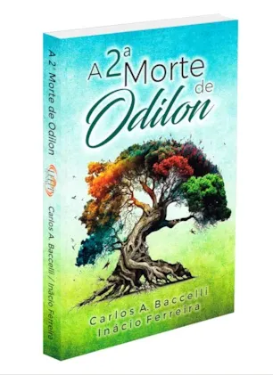

### Clube do Livro Espírita Padrinhos do Dr. Inácio Inácio Ferreira

#### 📖 Livro do Mês

**Resenha:**

A 2ª MORTE DE ODILON - Carlos A. Baccelli - Inácio Ferreira

Eis o relato do emocionante desenlace do grande amigo e benfeitor, Odilon Fernandes. Convocado às Esferas Superiores, Odilon passa a habitar na companhia de espíritos de sua elevada estirpe espiritual.

Esta obra constitui-se como um incentivo para todos nós — amigos e admiradores, encarnados e desencarnados — a fim de que possamos nos esforçar para seguir os seus passos. Um relato esclarecedor sobre a transição para planos mais sutis e a continuidade do trabalho no Bem, sob o estilo único e as reflexões profundas do Dr. Inácio Ferreira.

✦ Ficha Técnica

🖋 Autor / Médium: Carlos A. Baccelli
👁 Espírito: Inácio Ferreira
📚 Assunto: Vida no Além
🔖 ISBN: 978-65-88294-13-0
📄 Páginas: 272
📏 Dimensões: 14 × 21 cm

---


