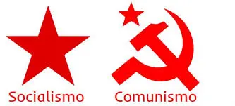

###### _por João Carrara_

Ao estudar a Doutrina Espirita devemos buscar compreender os ensinamentos dos nossos benfeitores maiores, de forma podermos entender a vontade de Deus nosso Pai.

Se procurarmos interpretar buscando a essência dos ensinamentos estaremos compreendendo melhor as Leis de Deus que regem a vida.

Vivemos em um mundo de prova e expiações onde a mentira e ideologias mais estranhas criadas pela humanidade se apresentam com objetivo de aprendermos a discernir entre o bem e o mal.

Muitas dessas ideias são revestidas com aparência que podem ludibriar nossos sentimentos induzindo nosso entendimento ao erro, e trazem na sua essência o veneno do egoísmo, gerada por mentes ciosas, prepotentes, de forma que tentam cooptar pessoas através de ideologias, sequestrando-as para depois escraviza-las e assim tentam burlar as Leis Divinas que tem como objetivo o crescimento da criatura através do trabalho digno dando a cada um conforme suas obras.

A Doutrina Espírita na sua essência mais pura é Jesus, Kardec, Chico Xavier onde encontramos os ensinamentos que são as diretrizes para nossa evolução e na medida que melhor entendemos e vivenciarmos os ensinamentos, a vida seguira sem tantos percalços.  

Vejamos as informações dos espíritos no Evangelho Segundo O Espiritismo edição EDICEL no item Explicações: 

A 9 de agosto de 1863, Kardec recebeu uma comunicação dos seus Guias, sobre a elaboração deste livro. A comunicação assinalava o seguinte: “Esse livro de doutrina terá influência considerável, porque explana questões de interesse capital. Não somente o mundo religioso encontrará nele as máximas de que necessita, como as nações, em sua vida prática, dele haurirão instruções excelentes. Fizeste bem ao enfrentar as questões de elevada moral prática, do ponto de vista dos interesses gerais, dos interesses sociais e dos interesses religiosos”.

Os Espíritos informam que temos no Evangelho Segundo o Espiritismo instruções excelentes para questões de elevada moral pratica, do ponto de vista dos interesses gerais, sociais e religiosos, assim como as nações na sua vida pratica as máximas que necessita.

Entre outras instruções vamos ver aquelas que nos esclarece a respeito do tema proposto.

No capítulo XVI   Não se pode servir a Deus e a Mamon, encontramos as instruções que elucidam nossas duvidas apresentando o planejamento Divino necessário à nossa evolução, através das diferentes posições socias vividas nas sucessivas reencarnações.

**Evangelho Segundo o Espiritismo Cap. XVI**
**Utilidade providencial da riqueza. Provas da riqueza e da miséria**
**Item 7.**
Neste item os espíritos nos esclarece que Deus permite a concentração da riqueza em determinadas mãos com objetivo de desenvolver o progresso intelectual e como consequência facilitar a vida do homem no planeta.
Sendo a riqueza o principal meio de execução do progresso material, sem ela deixará de haver grandes trabalhos, não mais haverá atividades nem estímulos, nem pesquisas. É, pois, com razão que a riqueza é considerada elemento de progresso.
Podemos ver os resultados do progresso já alcançado até o momento e citar, as facilidades do lar, meios de transportes, de comunicação, avanço da medicina e dos medicamentos, etc  

**Desigualdade das riquezas**
**Item 8.** A desigualdade das riquezas é um dos problemas que inutilmente se procurará resolver, desde que se considere apenas a vida atual.
Santo Agostinho diz que o Espiritismo vem lançar luz sobre os problemas do coração humano, e aqui está um dos maiores problema quando se considera apenas a vida atual, sem o entendimento da reencarnação, concluiríamos que há uma grande injustiça.

Temos ainda nas instruções dos Espíritos estes outros tópicos que completam a orientação.

**A verdadeira propriedade**
**Item 9.**
Os bens da Terra pertencem a Deus, que os distribui à vontade, não sendo o homem senão o usufrutuário, o administrador mais ou menos íntegro e inteligente desses bens. Tanto eles não constituem propriedade individual do homem, que Deus anula frequentemente todas as previsões, o que faz a riqueza escapar daquele que se julga com os melhores títulos para possuí-la.

**Emprego da riqueza**
**Item 11.**
Não; não podeis servir a Deus e a Mamon! Se, pois, sentis vossa alma dominada pelas cobiças da carne, apressai-vos em alijar o jugo que vos oprime, porque Deus, justo e severo, vos dirá: “Que fizeste, ecônomo infiel, dos bens que te confiei? Esse poderoso móvel de boas obras o empregaste exclusivamente na tua satisfação pessoal”.

**Desprendimento dos bens terrenos**
Podemos dizer que o espirita estudando atentamente este capitulo não se deixará enganar, discernindo o que é narrativa dos homens e a verdade que vem de Deus.
Somando a esse entendimento recorremos as perguntas do Livro dos Espíritos.

**119.** Não podia Deus isentar os Espíritos das provas que lhes cumpre sofrer para chegarem à primeira ordem?
“Se Deus os houvesse criado perfeitos, nenhum mérito teria para gozar dos benefícios dessa perfeição. Onde estaria o merecimento sem a luta? Demais, a desigualdade entre eles existente é necessária às suas personalidades. Acresce ainda que as missões que desempenham nos diferentes graus da escala estão nos desígnios da Providência, para a harmonia do Universo.”

Pois que, na vida social, todos os homens podem chegar às mais altas funções, seria o caso de perguntar-se por que o soberano de um país não faz de cada um de seus soldados um general; por que todos os empregados subalternos não são funcionários superiores; por que todos os colegiais não são mestres. Ora, entre a vida social e a espiritual há esta diferença: enquanto que a primeira é limitada e nem sempre permite que o homem suba todos os seus degraus, a segunda é indefinida e a todos oferece a possibilidade de se elevarem ao grau supremo.

Na questão acima Kardec esclarece que para evoluirmos precisamos passar por provas, e ele questiona aos espíritos se Deus não poderia nos isentar das lutas criando todos perfeitos.
E os espíritos respondem que a desigualdade é necessária ás suas personalidades, e ao seu desenvolvimento espiritual, o qual todos um dia poderá se elevar ao grau supremo. 
Bastaria esse entendimento para compreendermos as porque das diferenças sociais e espirituais. 
  
**708.** Não há situações em as quais os meios de subsistência de maneira alguma dependem da vontade do homem, sendo-lhe a privação do de que mais imperiosamente necessita uma consequência da força mesma das coisas?
“É isso uma prova, muitas vezes cruel, que lhe compete sofrer e à qual sabia ele de antemão que viria a estar exposto. Seu mérito então consiste em submeter-se à vontade de Deus, desde que a sua inteligência nenhum meio lhe faculta de sair da dificuldade. Se a morte vier colhê-lo, cumpre-lhe recebê-la sem murmurar, ponderando que a hora da verdadeira libertação soou e que o desespero no derradeiro momento pode ocasionar-lhe a perda do fruto de toda a sua resignação.”

Na questão acima vemos o determinismo da lei Divina e Sua vontade tendo como objetivo a evolução da criatura.
Podemos entender que através das desigualdades sociais entre as criaturas é que surgem as oportunidades de exercício das virtudes, praticando a caridade exercitando o desprendimento dos bens materiais, a abnegação, a humildade, devotamento ao próximo, enfim todas as virtudes necessárias a nossa evolução.
Interessante observar que pela prática da caridade que é uma lei Divina, Deus permite através dela a interferir na lei de causa e efeito aliviando as provas do próximo seus sofrimentos.  

# Conclusão
O Espiritismo, conforme codificado por Allan Kardec, se propõe a ser uma doutrina moral e filosófica, não um projeto político. Ainda assim, é possível apontar pontos de aproximação e de divergência entre o pensamento espírita e o comunismo, no plano dos valores, sem confundi-los.

**Pontos de possível concordância (parcial)**
1. **Igualdade essencial dos seres humanos**
O Espiritismo ensina que todos os Espíritos são criados iguais, ou seja, simples e ignorantes e evoluem ao longo do tempo.
→ Isso dialoga com a ideia de igualdade humana defendida pelo comunismo, mas em sentido espiritual, não econômico.
2. **Crítica ao egoísmo e à exploração**
A doutrina espírita condena:
• exploração do homem pelo homem
• acúmulo egoísta de riquezas sem produzir o bem
• indiferença social
3. **Responsabilidade social**
O Espiritismo afirma que a riqueza é uma prova e gera deveres morais, como:
• caridade
• solidariedade
• auxílio aos necessitados.
• elemento de progresso

**Pontos claros de discordância**
4. **Materialismo**
• O comunismo clássico (especialmente o marxista) é materialista e geralmente ateu.
• O Espiritismo é espiritualista, baseia-se na imortalidade da alma e na vida futura.
Isso é uma divergência fundamental.

5. **Coerção versus transformação moral**
• Comunismo: busca igualdade por meio de estrutura estatal e imposição coletiva
• Espiritismo: propõe a igualdade pela transformação moral do indivíduo, pelo livre-arbítrio
Kardec é claro ao afirmar que:
“O progresso real da humanidade é moral, não apenas social.”

6. **Abolição da propriedade privada**
• O Espiritismo não condena a propriedade privada em si.
• O problema, segundo a doutrina, é o uso egoísta da riqueza, não sua existência.

7. **Luta de classes**
O Espiritismo não endossa a ideia de luta ou antagonismo entre classes.
Defende:
• fraternidade
• cooperação
• reconciliação entre os homens

**Síntese equilibrada**
• O Espiritismo não é comunista, nem capitalista.
• Ele concorda com valores morais universais como justiça social e fraternidade.
• Mas rejeita o materialismo, a imposição ideológica e a supressão do livre-arbítrio.

Kardec resumiria assim:
• a sociedade melhora quando o homem melhora
• leis e sistemas ajudam, mas não substituem a reforma íntima

**8. Igualdade essencial dos homens**
Pergunta 803 – O Livro dos Espíritos
“Perante Deus, todos os homens são iguais; o que os distingue é o grau de perfeição alcançado.”
Interpretação espírita
• A igualdade é espiritual, não imposta economicamente.
• As diferenças sociais são provas temporárias, não privilégios eternos.
Aqui há convergência parcial com a ideia de igualdade humana, mas o fundamento é espiritual, não materialista.

**9. Desigualdade social e riqueza**
Pergunta 806
“A desigualdade das condições sociais é uma lei natural?”
Resposta: “Não; é obra do homem, não de Deus.”
• O Espiritismo reconhece que a desigualdade injusta é criação humana.
• Mas não conclui que a solução seja abolir a propriedade privada.

**10. Propriedade privada**
Pergunta 882
“Qual é o primeiro de todos os direitos naturais do homem?”
Resposta: “O de viver. É por isso que ninguém tem o direito de atentar contra a vida de seu semelhante.”
Pergunta 884
“Qual o caráter da propriedade?”
Resposta: “É um direito natural, mas que deve ser regulado pela justiça.”
• O Espiritismo reconhece a propriedade, mas subordinada à justiça e ao bem comum.
• Diferente do comunismo clássico, que propõe sua eliminação.

**11. Uso da riqueza (ponto-chave)**
Pergunta 814
“Por que Deus concede riquezas a uns e não a outros?”
Resposta:
“Para experimentá-los de maneiras diferentes. Além disso, para que os ricos tenham o meio de fazer o bem.”
• A riqueza é uma prova moral, não um direito absoluto.
• O erro não é possuir, mas reter egoisticamente.

**12. Crítica à imposição e à violência social**
Kardec, em A Gênese, cap. XVIII:
“A verdadeira regeneração da humanidade depende da melhoria moral dos indivíduos.”
• O Espiritismo rejeita a ideia de que mudanças estruturais forçadas resolvam o problema humano.
• Sem reforma íntima, qualquer sistema falha — seja comunista ou capitalista.

**Conclusão clara**
O Espiritismo:
• defende justiça social
• condena exploração e egoísmo
• promove fraternidade
Mas não apoia:
• materialismo
• luta de classes
• imposição estatal da igualdade
• negação da espiritualidade

**Resumo em uma frase:**
O Espiritismo busca uma sociedade justa pela transformação moral do indivíduo, não por revoluções ideológicas.

**Espiritismo × Marxismo (Comunismo)**

| Tema | Espiritismo (Kardec) | Marxismo / Comunismo |
| :--- | :--- | :--- |
| Natureza do ser humano | Espírito imortal em evolução | Ser material condicionado pela economia |
| Visão do mundo | Espiritualista | Materialista |
| Deus / espiritualidade | Deus existe; leis morais universais | Geralmente ateu ou antirreligioso |
| Igualdade | Espiritual: todos os Espíritos são iguais perante Deus | Econômica e social, imposta pelo sistema |
| Origem da desigualdade | Egoísmo e atraso moral do homem | Propriedade privada e exploração econômica |
| Solução para injustiça social | Reforma íntima + educação moral | Revolução social e mudança estrutural |
| Propriedade privada | Permitida, mas com responsabilidade moral | Deve ser abolida |
| Riqueza | Prova moral; meio de fazer o bem | Instrumento de opressão de classe |
| Luta de classes | Rejeitada; defende fraternidade | Central para a transformação social |
| Uso da força / coerção | Não aceita imposição moral | Aceita coerção revolucionária |
| Liberdade individual | Fundamental (livre-arbítrio) | Subordinada ao coletivo |
| Objetivo final | Progresso moral do Espírito | Sociedade sem classes |

**13. Onde nasce a confusão**
Muita gente acha que o Espiritismo é “socialista” porque ele:
• critica o egoísmo
• defende justiça social
• valoriza solidariedade
• condena a miséria evitável
Mas o caminho é totalmente diferente:
• o comunismo muda o sistema esperando que o homem mude
• o Espiritismo muda o homem esperando que a sociedade melhore

**Como Kardec resumiria (síntese fiel)**
“Não é mudando as instituições que se muda o coração do homem, mas mudando o homem que as instituições se tornam justas.”

(observação importante)
Alguns espíritas pessoalmente adotaram ideias de esquerda ou direita — isso é opinião individual, não doutrina.
A doutrina espírita não autoriza:
• militância partidária em nome do Espiritismo
• uso da religião como instrumento ideológico

**Conclusão direta**
• O Espiritismo concorda com o ideal de justiça
• Mas discorda radicalmente do materialismo, da coerção e da luta de classes.

**14. Então seguem posições e frases atribuídas a Chico Xavier, com contexto, para evitar interpretações fora da doutrina.**
**Espiritismo não é ideologia política**
• Chico sempre foi muito cauteloso em separar Espiritismo de política partidária. Ele afirmava, em diversas entrevistas, ideias resumidas assim:
• “O Espiritismo não é partido político, é uma doutrina de renovação moral.”
• O espírita pode ter opinião política individual
• Mas não pode falar em nome da doutrina para defender sistemas políticos

**15. Justiça social, sem violência**
• Chico era profundamente sensível ao sofrimento dos pobres, mas rejeitava a violência revolucionária:
• “Sem Jesus no coração, qualquer sistema se transforma em …(fracasso)

**16. O Espiritismo e o voto**
• O Espiritismo não diz em quem votar, mas como votar.
**Princípio central**
• Consciência, responsabilidade e ética.
Segundo a visão espírita:
• o voto é um ato moral
• cada escolha gera responsabilidade espiritual
• não existe “voto neutro” do ponto de vista ético

**17. Critérios espíritas para avaliar candidatos e propostas**
Inspirados em O Livro dos Espíritos e no Evangelho:
• Caráter acima da ideologia
Mais importante que “direita” ou “esquerda”:
• honestidade
• respeito à vida
• compromisso com o bem comum
“Reconhece-se o verdadeiro homem de bem pela sua conduta.”
(O Evangelho segundo o Espiritismo, cap. XVII)

**18. Rejeição ao ódio e à violência**
O Espiritismo não apoia discursos que:
• promovam ódio de classe
• desumanizem adversários
• justifiquem violência “em nome do bem”

**19. Defesa da dignidade humana**
Um espírita tende a apoiar propostas que:
• reduzam miséria e exclusão
• promovam educação
• respeitem os mais vulneráveis
Mas sem aceitar meios imorais para fins supostamente nobres.

**20. Liberdade de consciência**
O Espiritismo:
• valoriza o livre-arbítrio
• rejeita regimes que suprimam liberdades fundamentais
• vê a coerção como sinal de atraso moral

**21. Participação política do espírita**
O espírita pode:
• votar
• participar de debates
• ocupar cargos públicos
• militar politicamente em nome próprio
Mas não deve:
• usar o Espiritismo como bandeira partidária
• afirmar que “a doutrina apoia tal sistema”
• transformar centro espírita em palanque político
Kardec foi claro: O Espiritismo não se mistura às paixões humanas.
• O Espiritismo não promete “sociedade perfeita” por decreto.
• Ensina que leis justas ajudam, mas não substituem consciência reta.
Por isso:
• rejeita o materialismo do comunismo
• rejeita o egoísmo extremo do liberalismo sem ética
• propõe um caminho moral acima dos rótulos

**22. Kardec e Chico Xavier são coerentes nisso:**
Nenhuma ideologia reforma o homem por decreto.
• leis mudam comportamentos
• sistemas organizam a sociedade
• só a moral transforma o Espírito

**23. O diferencial espírita**
O Espiritismo acrescenta algo que ideologias não conseguem oferecer:
• imortalidade da alma
• responsabilidade além desta vida
• lei de causa e efeito
• progresso espiritual contínuo
Sem isso, qualquer sistema tende a:
• concentrar poder
• gerar opressão
• repetir erros com novos nomes

**Frase-síntese final**
O Espiritismo não é de esquerda nem de direita.
É de consciência.
Não propõe revolução social.
Propõe revolução moral.