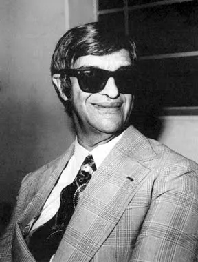
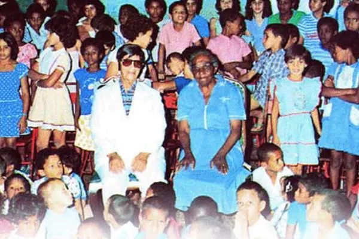

# O Mandato de Amor e a Fidelidade ao Cristo

Francisco Cândido Xavier não foi apenas um médium; foi um fenômeno de renúncia e disciplina que alterou os rumos do Espiritismo no Brasil e no mundo. Beber na fonte de quem conviveu com ele, como **Carlos Baccelli** e **Drª. Marlene Nobre**, nos permite enxergar o homem por trás do fenômeno, cuja vida foi o seu maior livro.

## O Mandato Mediúnico e a Disciplina

Segundo os relatos de seus biógrafos e amigos próximos, a mediunidade de Chico não era um simples dom, mas um **mandato de missão**. Desde o encontro com Emmanuel em 1931, a diretriz foi clara: *Disciplina, Disciplina e Disciplina.*

Chico abdicou de vida privada, posses e descanso para servir de ponte entre dois mundos. Ele psicografou mais de 500 livros, cujos direitos autorais foram integralmente doados a instituições de caridade, reafirmando seu desapego absoluto e caráter ilibado.

### O Testemunho de Carlos Baccelli
Carlos Baccelli, que acompanhou Chico em Uberaba por décadas, ressalta em obras como *"Chico Xavier, à sombra do abacateiro"* que a maior força de Chico não estava nos prodígios, mas na sua **humildade inabalável**.

> "Chico nunca se sentiu o dono da mensagem, mas o servidor da palavra." 

### A Preservação da Memória com Geraldo Lemos Neto
Geraldo Lemos Neto, fundador da [Vinha de Luz](https://vinhadeluz.com.br), destaca o lado humano e o acolhimento que o médium dispensava a todos. É através de Geraldo que conhecemos detalhes profundos sobre a "Data Limite" e o papel do Brasil como o Coração do Mundo e Pátria do Evangelho.

---

## Caráter Ilibado e Vínculo com o Cristo

Chico não pregava o Evangelho; ele o vivia. Sua existência era uma extensão das bem-aventuranças. Mesmo sob calúnias ou perseguições, sua resposta era o silêncio respeitoso ou a prece. Ele consolidou o "Espiritismo Prático", onde o conhecimento doutrinário se traduzia em amparo aos necessitados e consolo às famílias enlutadas.

## Conclusão

Ao olharmos para a trajetória de Chico sob a ótica de seus amigos e biógrafos, compreendemos que ele foi o *fiel seguidor* que o Consolador Prometido precisava para florescer em solo brasileiro. Seu mandato foi cumprido com a pureza de quem sabia que era apenas um "cisco", mas um cisco que permitiu à luz do Alto brilhar sem obstáculos.

---

## Conteúdo Recomendado (Vídeos)

Para aprofundar o estudo sobre a vida de Chico Xavier, selecionamos conteúdos essenciais:

* **[Hilárias e Sábias Lições de Chico Xavier com Carlos Baccelli](https://www.youtube.com/live/kotMQbExGiM?si=P6WTABeaHzhGkTKK)** - Baccelli é médium espírita, fundador do Lar Espírita Pedro e Paulo em Uberaba-MG. É reconhecido como o maior biógrafo de Chico Xavier.
* **[Drª. Marlene Nobre. A convivência com Chico Xavier](https://www.youtube.com/watch?v=1kfuIidocrQ)** - Entrevista realizada no dia 12 de dezembro de 2014.
* **[Chico Xavier no Programa Pinga-Fogo (Tupi)](https://lecitatiba.com.br/pinga-fogo/ )** - O marco histórico da divulgação espírita-cristã no Brasil.

---
*Este artigo é uma contribuição do **Lar Espírita Cristão - Itatiba (LEC)** para a divulgação doutrinária.*
